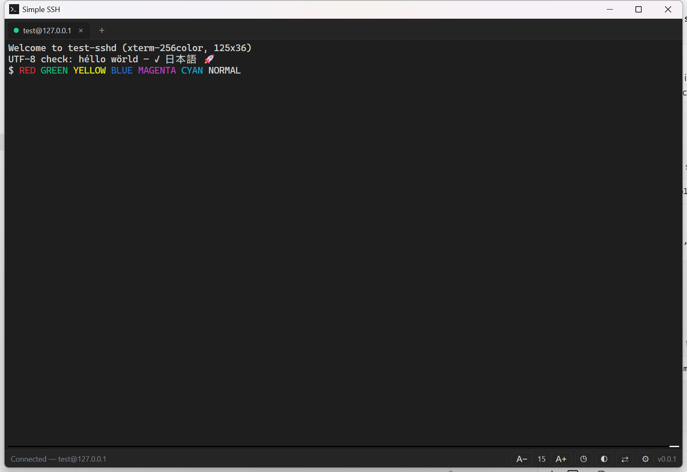

# Simple SSH

A lightweight, secure SSH client for Windows — built with [Tauri](https://tauri.app/),
[russh](https://github.com/warp-tech/russh), and [xterm.js](https://xtermjs.org/).

Simple SSH gives you a fast, tabbed terminal for connecting to remote hosts, with saved
connection profiles, OS-encrypted secret storage, and host-key verification — without the
weight of a full terminal suite.



## Features

- **Tabbed sessions** — open and switch between multiple SSH connections in one window.
- **Connection profiles** — save hosts, ports, usernames, and auth method for one-click reconnect.
- **Recent connections** — recently used targets are recorded automatically for quick access.
- **~/.ssh/config import** — pull Host entries straight into the connect form.
- **Local port forwarding** — `-L`-style tunnels, managed per tab from the ⇄ panel.
- **Auto-reconnect** — a dropped session shows a one-click reconnect overlay.
- **Multiple auth methods** — password, private key (with passphrase), and SSH agent.
  (PuTTY `.ppk` keys are not supported — export to OpenSSH format with PuTTYgen.)
- **Keyboard-interactive auth** — supports MFA/OTP challenges.
- **Encrypted secret storage** — passwords and key passphrases are stored in the Windows
  Credential Manager; plaintext is never written to disk.
- **Host-key verification** — unknown and changed host keys prompt for an explicit trust
  decision (TOFU), with SHA-256 fingerprints.
- **Color schemes** — Dracula, Solarized Dark/Light, Gruvbox Dark, and One Dark, or auto-match
  the app's light/dark theme.
- **Terminal settings** — font family, cursor style and blink, scrollback, and line height,
  applied live to all open tabs.
- **Tab niceties** — middle-click close, drag to reorder, rename, and duplicate.
- **Terminal niceties** — in-terminal search, right-click copy/paste menu, adjustable font
  size, and a light/dark theme toggle.

## Requirements

- Windows 10/11 (x64)
- For building from source: [Node.js](https://nodejs.org/) 18+ with npm, and a
  [Rust toolchain](https://rustup.rs/) (stable, MSVC)

## Getting started (development)

```bash
npm install
npm run dev
```

`npm run dev` launches the app via the Tauri CLI with hot reload for the UI (Vite) and
automatic rebuild for the Rust backend.

A throwaway SSH server for manual testing is included:

```bash
node scripts/test-sshd.cjs 2222   # user "test", password "secret123"
```

It also accepts user `mfa` (keyboard-interactive: password, then OTP `42`) for testing MFA
prompts, user `keyuser` (any public key) for key auth, and echoes on forwarded direct-tcpip
connections for tunnel testing.

## Building

```bash
npm run build
```

This typechecks, bundles the UI, compiles the Rust backend in release mode, and produces two
usable artifacts:

```
src-tauri/target/release/
├── simple-ssh.exe                                  # standalone, self-contained app (~13 MB)
└── bundle/nsis/Simple SSH_<version>_x64-setup.exe  # per-user NSIS installer (~3 MB)
```

The standalone exe is fully portable — UI assets are embedded in the binary and the WebView2
runtime ships with Windows — so copying it somewhere and running it is a perfectly good
"install". The NSIS installer adds Start-menu/desktop shortcuts and an uninstaller.

> **Unsigned-build note:** the build is not code-signed. On systems with Smart App Control
> enabled (or in Evaluation mode), the unsigned NSIS installer may be blocked and crash
> silently when launched. If that happens, just use the standalone `simple-ssh.exe` instead.

App data (profiles, known hosts) lives in `%APPDATA%\com.simplessh.app`; saved passwords and
passphrases live in the Windows Credential Manager — the same regardless of how the app is run.

## Scripts

| Script | Description |
| --- | --- |
| `npm run dev` | Run the app in development with hot reload |
| `npm run build` | Build the release app + NSIS installer |
| `npm run typecheck` | Typecheck the renderer and config TypeScript |
| `npm run lint` | Run ESLint |
| `npm run format` | Format sources with Prettier |
| `cargo test` (in `src-tauri/`) | Run Rust backend unit tests |

## Project structure

```
src/
├── renderer/    UI — tabs, terminal, connect form, host-key & MFA dialogs (vanilla TS)
└── shared/      Types shared between the renderer and the API bridge
src-tauri/
└── src/         Rust backend — SSH sessions (russh), profiles, secrets, known-hosts
```

The renderer talks to the backend through a single typed surface (`window.ssh`, see
`src/shared/api.ts`), implemented over Tauri commands and events in
`src/renderer/ssh-api.ts`. Terminal output streams over a per-session raw-byte IPC channel.

## Security

- The UI runs in a WebView with a strict Content-Security-Policy; all privileged work
  (network, file system, secrets) happens in the Rust backend.
- Secrets are stored in the Windows Credential Manager and are only persisted on a
  successful connection (and only when you opt in). Plaintext never crosses into the UI.
- Host keys are verified on every connection; changes are surfaced loudly.

## Author

stumat1 <stumat1@mailbox.org>

## License

MIT
